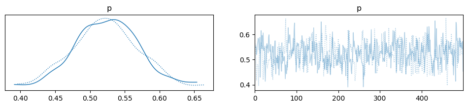
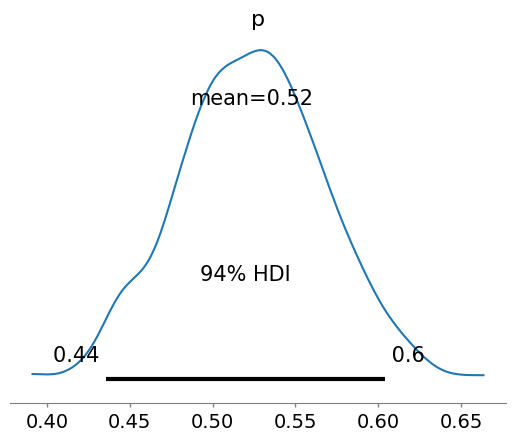

<script type="text/x-mathjax-config">
    MathJax.Hub.Config({
        tex2jax: {
        skipTags: ['script', 'noscript', 'style', 'textarea', 'pre'],
        inlineMath: [['$','$']]
        }
    });
    </script>
      
<script type="text/javascript" async src="https://cdn.mathjax.org/mathjax/latest/MathJax.js?config=TeX-MML-AM_CHTML"> </script>

***

# Bayesian Statistics

**Update our belief based on the data**

*Posted on September 2023*

***

The ability to estimate parameters based on data in maximum likelihood estimation is powerful. However, there is some caveat if we only rely on data. Take a process of a fair coin toss for example, there are two spaces, either the coin lands in head or tail. We do 10 tosses of coin, then the result shows that 7 out of 10 tosses result in head while only 3 result in tail. Then we model this using Bernoulli distribution and estimate its parameter using maximum likelihood estimation. We find that there is a 0.7 probability that a coin toss will land on heads.

Well this is clearly a false model, far from the truth. We know that a fair coin has about 50-50 in either landing on head or tail. But the data that we observed differ from this belief. If we do 10 tosses again then we might have 4 heads and 6 tails which result in a different model from previously.

Turns out to make an inference, we also need prior belief or model. This is the beginning of Bayesian statistics.

## Bayes Theorem

Bayes theorem says that the probability of an event $A$ given $B$ is proportional to the probability of an event $B$ given $A$ times the probability of $A$, mathematically

$$p(A \mid B) \propto p(B \mid A) \times p(A)$$

Now if we apply this theorem to the process and data relationship we get: the probability of a parameter from model given the data (what we are trying to do earlier) is proportional to the probability of the data given the parameter times the probability of the parameter, mathematically

$$p(\theta{} \mid Y) \propto p(Y \mid \theta{}) \times p(\theta)$$

The probability of the data given the parameter is identical to the likelihood function of the parameter and we have

$$p(\theta{} \mid Y) \propto L(\theta{} \mid Y) \times p(\theta)$$

Usually, the product of likelihood function and prior distribution does not result in a nice function to be solved analytically. So in practice, simulation is used to create new data from posterior distribution. Then we can calculate the confidence interval for the parameter.

## Example of Bayesian Analysis in Python using pymc

Below is an example of Bayesian analysis using pymc3. Pymc3 is a probabilistic programming language (PPL) that expands computer capabilities to do bayesian analysis. I only learned about PPL at the time of this writing. Maybe I will write about this next time.


```python
import pandas as pd
import arviz as az
import pymc as pm
```

Process: 10 tosses of coin, 7 heads and 3 tails. Head:1, tail:0


```python
tosses = [1, 0, 1, 1, 0, 1, 0, 1, 1, 1]

df = pd.DataFrame(tosses, columns=["Outcomes"])
df.value_counts()
```


    Outcomes
    1           7
    0           3
    dtype: int64


```python
prior_prob=df.value_counts()[1]/len(tosses)
```


```python
basic_model = pm.Model()

with basic_model:

    # Parameter for prior, the sigma is 0.05 because we are so sure that a coin toss have a probability 0.05 to land on head
    p = pm.Normal('p', mu=0.5, sigma=0.05)

    # Likelihood
    posterior_prob = pm.Bernoulli("Posterior", p=p, observed=tosses)
```


```python
with basic_model:
    # draw 500 posterior samples
    trace = pm.sample(500, return_inferencedata=True)
```


<style>
    /* Turns off some styling */
    progress {
        /* gets rid of default border in Firefox and Opera. */
        border: none;
        /* Needs to be in here for Safari polyfill so background images work as expected. */
        background-size: auto;
    }
    progress:not([value]), progress:not([value])::-webkit-progress-bar {
        background: repeating-linear-gradient(45deg, #7e7e7e, #7e7e7e 10px, #5c5c5c 10px, #5c5c5c 20px);
    }
    .progress-bar-interrupted, .progress-bar-interrupted::-webkit-progress-bar {
        background: #F44336;
    }
</style>


<div>
  <progress value='1500' class='' max='1500' style='width:300px; height:20px; vertical-align: middle;'></progress>
  100.00% [1500/1500 00:02&lt;00:00 Sampling chain 0, 0 divergences]
</div>


<style>
    /* Turns off some styling */
    progress {
        /* gets rid of default border in Firefox and Opera. */
        border: none;
        /* Needs to be in here for Safari polyfill so background images work as expected. */
        background-size: auto;
    }
    progress:not([value]), progress:not([value])::-webkit-progress-bar {
        background: repeating-linear-gradient(45deg, #7e7e7e, #7e7e7e 10px, #5c5c5c 10px, #5c5c5c 20px);
    }
    .progress-bar-interrupted, .progress-bar-interrupted::-webkit-progress-bar {
        background: #F44336;
    }
</style>


<div>
  <progress value='1500' class='' max='1500' style='width:300px; height:20px; vertical-align: middle;'></progress>
  100.00% [1500/1500 00:02&lt;00:00 Sampling chain 1, 0 divergences]
</div>


Below is the distribution of the parameter p (or the probability in this case because the use of Bernoulli distribution)


```python
with basic_model:
    az.plot_trace(trace);
```


    

    


Below is the descriptive statistics of the parameter


```python
with basic_model:
    display(az.summary(trace, round_to=2))
```


  <div id="df-7a4ee4f3-1303-4426-9284-9bbdfc5f96b8" class="colab-df-container">
    <div>
<style scoped>
    .dataframe tbody tr th:only-of-type {
        vertical-align: middle;
    }

    .dataframe tbody tr th {
        vertical-align: top;
    }

    .dataframe thead th {
        text-align: right;
    }
</style>
<table border="1" class="dataframe">
  <thead>
    <tr style="text-align: right;">
      <th></th>
      <th>mean</th>
      <th>sd</th>
      <th>hdi_3%</th>
      <th>hdi_97%</th>
      <th>mcse_mean</th>
      <th>mcse_sd</th>
      <th>ess_bulk</th>
      <th>ess_tail</th>
      <th>r_hat</th>
    </tr>
  </thead>
  <tbody>
    <tr>
      <th>p</th>
      <td>0.52</td>
      <td>0.05</td>
      <td>0.44</td>
      <td>0.6</td>
      <td>0.0</td>
      <td>0.0</td>
      <td>447.8</td>
      <td>779.37</td>
      <td>1.0</td>
    </tr>
  </tbody>
</table>
</div>
    <div class="colab-df-buttons">

  <div class="colab-df-container">
    <button class="colab-df-convert" onclick="convertToInteractive('df-7a4ee4f3-1303-4426-9284-9bbdfc5f96b8')"
            title="Convert this dataframe to an interactive table."
            style="display:none;">

  <svg xmlns="http://www.w3.org/2000/svg" height="24px" viewBox="0 -960 960 960">
    <path d="M120-120v-720h720v720H120Zm60-500h600v-160H180v160Zm220 220h160v-160H400v160Zm0 220h160v-160H400v160ZM180-400h160v-160H180v160Zm440 0h160v-160H620v160ZM180-180h160v-160H180v160Zm440 0h160v-160H620v160Z"/>
  </svg>
    </button>

  <style>
    .colab-df-container {
      display:flex;
      gap: 12px;
    }

    .colab-df-convert {
      background-color: #E8F0FE;
      border: none;
      border-radius: 50%;
      cursor: pointer;
      display: none;
      fill: #1967D2;
      height: 32px;
      padding: 0 0 0 0;
      width: 32px;
    }

    .colab-df-convert:hover {
      background-color: #E2EBFA;
      box-shadow: 0px 1px 2px rgba(60, 64, 67, 0.3), 0px 1px 3px 1px rgba(60, 64, 67, 0.15);
      fill: #174EA6;
    }

    .colab-df-buttons div {
      margin-bottom: 4px;
    }

    [theme=dark] .colab-df-convert {
      background-color: #3B4455;
      fill: #D2E3FC;
    }

    [theme=dark] .colab-df-convert:hover {
      background-color: #434B5C;
      box-shadow: 0px 1px 3px 1px rgba(0, 0, 0, 0.15);
      filter: drop-shadow(0px 1px 2px rgba(0, 0, 0, 0.3));
      fill: #FFFFFF;
    }
  </style>

    <script>
      const buttonEl =
        document.querySelector('#df-7a4ee4f3-1303-4426-9284-9bbdfc5f96b8 button.colab-df-convert');
      buttonEl.style.display =
        google.colab.kernel.accessAllowed ? 'block' : 'none';

      async function convertToInteractive(key) {
        const element = document.querySelector('#df-7a4ee4f3-1303-4426-9284-9bbdfc5f96b8');
        const dataTable =
          await google.colab.kernel.invokeFunction('convertToInteractive',
                                                    [key], {});
        if (!dataTable) return;

        const docLinkHtml = 'Like what you see? Visit the ' +
          '<a target="_blank" href=https://colab.research.google.com/notebooks/data_table.ipynb>data table notebook</a>'
          + ' to learn more about interactive tables.';
        element.innerHTML = '';
        dataTable['output_type'] = 'display_data';
        await google.colab.output.renderOutput(dataTable, element);
        const docLink = document.createElement('div');
        docLink.innerHTML = docLinkHtml;
        element.appendChild(docLink);
      }
    </script>
  </div>

    </div>
  </div>


```python
with basic_model:
    az.plot_posterior(trace);
```


    

    


As we can see we have updated our initial belief about the data to be closer to the data.
